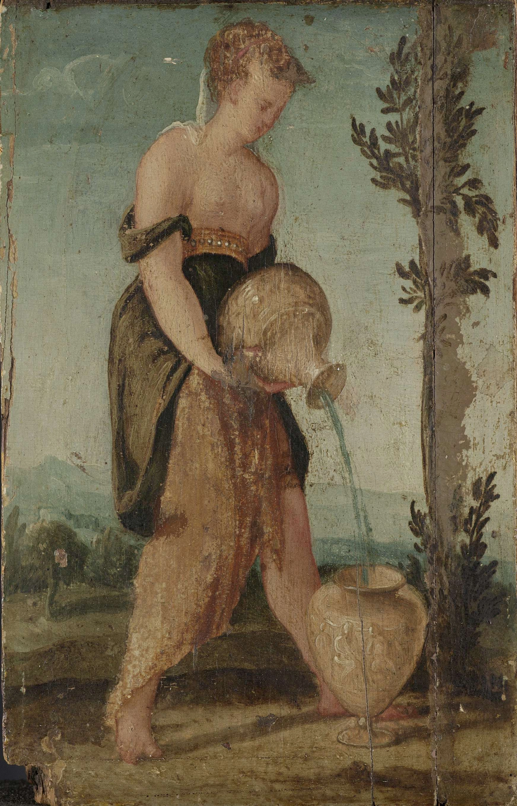

# jinja2_helper
Jinja2 helper makes it easier to use jinja2 library.

##

- 
- 
"<a target="_blank" rel="noopener noreferrer" href="https://www.rijksmuseum.nl/en/collection/SK-A-3424">Woman with Water Jug, Lambert Sustris, 1540 - 1570</a>" by Lambert Sustris is marked with <a target="_blank" rel="noopener noreferrer" href="https://creativecommons.org/publicdomain/zero/1.0/?ref=openverse">CC0 1.0 </img></img></a>. 
 
